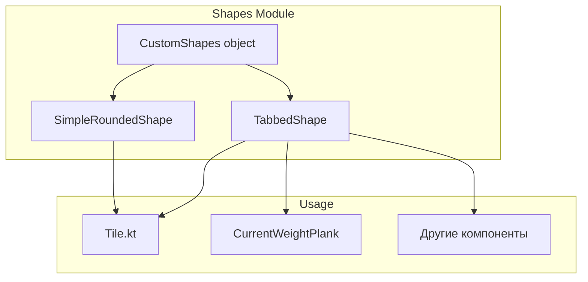

# Система кастомных форм VitanlyApp

## Обзор

Универсальная система кастомных форм для плашек в Jetpack Compose с поддержкой градиентов и настраиваемых параметров.

## Архитектура

```
ui/design/
├── CustomShapes.kt    # TabbedShape, SimpleRoundedShape, CustomShapes object
├── DesignTokens.kt    # Токены размеров и градиенты для форм
└── Modifiers.kt       # shapedSurface модификатор
```



## TabbedShape — форма с выступом

Прямоугольник с вертикальным выступом ("ушком") справа.

### Параметры

| Параметр | Тип | По умолчанию | Описание |
|----------|-----|--------------|----------|
| `tabWidth` | Dp | 80.dp | Ширина выступа |
| `tabExtensionTop` | Dp | 60.dp | Насколько выступ выходит вверх |
| `tabExtensionBottom` | Dp | 60.dp | Насколько выступ выходит вниз |
| `tabOffsetX` | Dp | 80.dp | Отступ выступа от правого края |
| `cornerRadius` | Dp | 24.dp | Радиус скругления основных углов |
| `tabCornerRadius` | Dp | 20.dp | Радиус скругления углов выступа |

### Примеры использования

```kotlin
// Базовое использование
Box(
    modifier = Modifier
        .size(300.dp, 100.dp)
        .clip(TabbedShape())
        .background(Color.White)
)

// С градиентом
Box(
    modifier = Modifier
        .size(300.dp, 100.dp)
        .clip(TabbedShape(tabWidth = 90.dp))
        .background(DesignTokens.shapeGradientLight)
)

// Кастомные параметры (как в плашке "текущий вес")
val plankShape = TabbedShape(
    tabWidth = 90.dp,
    tabExtensionTop = 39.dp,
    tabExtensionBottom = 39.dp,
    tabOffsetX = 8.dp,
    cornerRadius = 12.dp,
    tabCornerRadius = 12.dp
)
```

## Предустановленные формы (CustomShapes object)

```kotlin
// Форма по умолчанию
CustomShapes.TabbedDefault

// Компактная версия
CustomShapes.TabbedCompact

// Фабричный метод с параметрами
CustomShapes.tabbed(
    tabWidth = 60.dp,
    tabExtensionTop = 40.dp,
    ...
)

// Простая скруглённая форма
CustomShapes.rounded(cornerRadius = 24.dp)
```

## Градиенты для форм (DesignTokens)

| Градиент | Описание |
|----------|----------|
| `shapeGradientLight` | Светло-серый (белый → #D9D9D9) |
| `shapeGradientCream` | Кремовый (в стиле приложения) |
| `shapeGradientNeutral` | Нейтральный серый |
| `shapeGradientAccent` | Бирюзовый акцентный |

```kotlin
// Использование градиента
Box(
    modifier = Modifier
        .clip(TabbedShape())
        .background(DesignTokens.shapeGradientLight)
)
```

## Интеграция с Tile

Компонент `Tile` поддерживает кастомные формы:

```kotlin
Tile(
    position = position,
    isExpanded = isExpanded,
    isCollapsed = isCollapsed,
    onClick = onClick,
    shape = TabbedShape(),                    // Кастомная форма
    backgroundBrush = DesignTokens.shapeGradientLight,  // Градиент
    // или
    backgroundColor = Color.White             // Сплошной цвет
) {
    // контент
}
```

## Использование с shapedSurface

Для плашек внутри плиток используйте модификатор `shapedSurface`:

```kotlin
Box(
    modifier = Modifier
        .shapedSurface(
            shape = TabbedShape(...),
            elevation = 0.dp,
            backgroundColor = DesignTokens.plankBackground
        )
)
```

## Текущее использование в проекте

- **CurrentWeightPlank** (`KbjuTileContent.kt`) — плашка "текущий вес" с выступом под wheel picker

## Файлы

- `app/src/main/java/com/example/vitanlyapp/ui/design/CustomShapes.kt`
- `app/src/main/java/com/example/vitanlyapp/ui/design/DesignTokens.kt`
- `app/src/main/java/com/example/vitanlyapp/ui/design/Modifiers.kt`
- `app/src/main/java/com/example/vitanlyapp/ui/component/Tile.kt`
